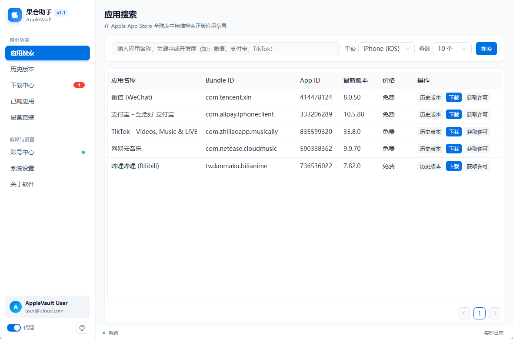
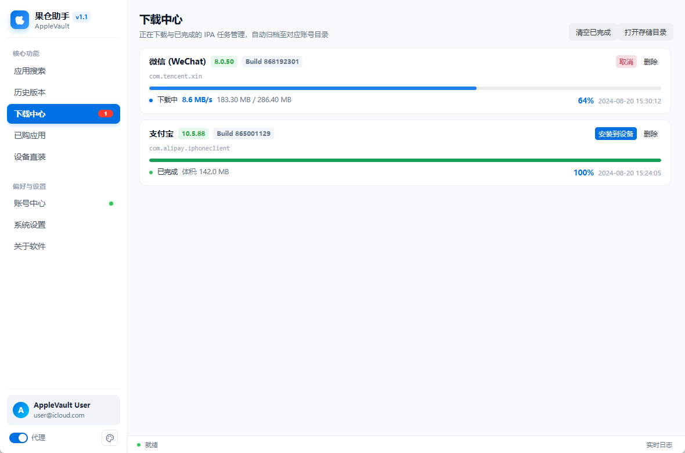
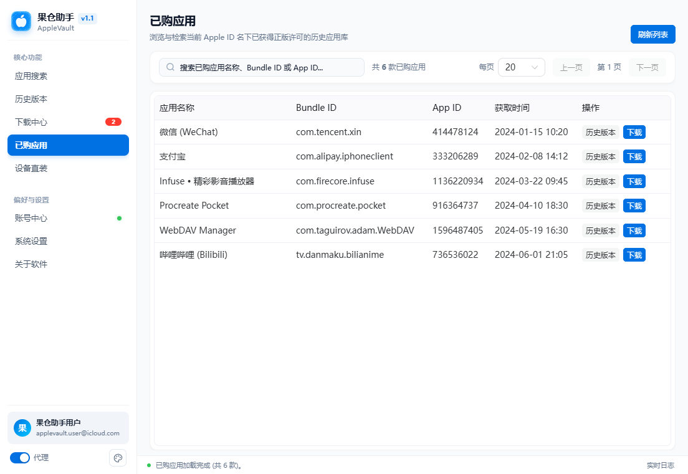
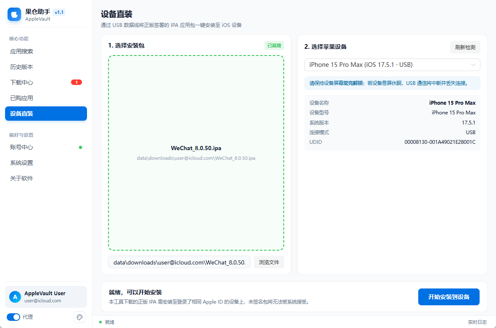
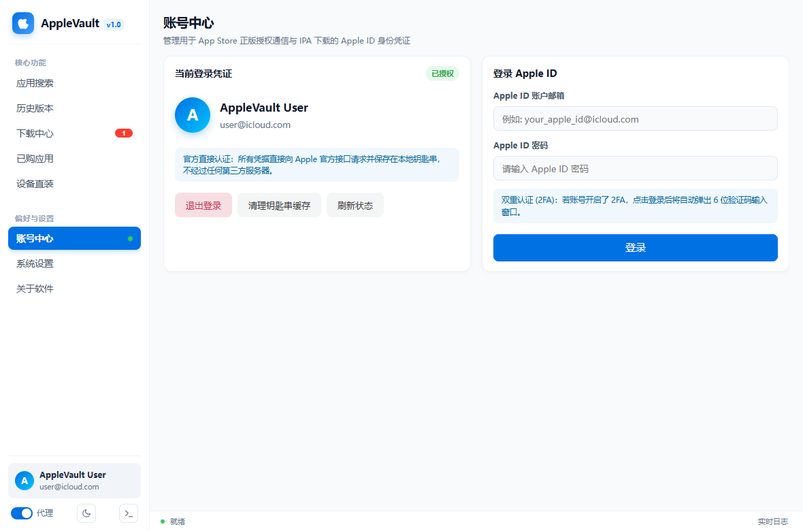
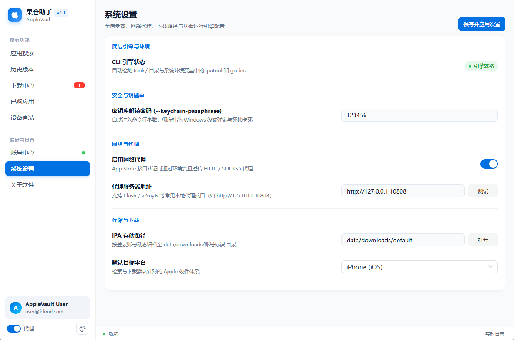
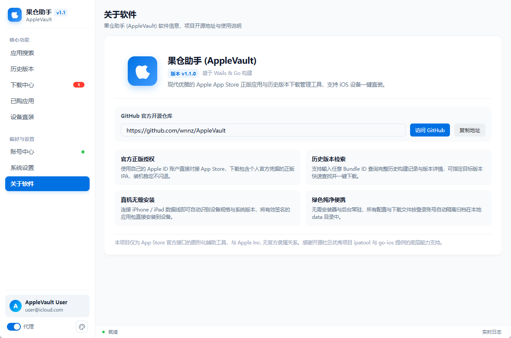

# 果仓助手 (AppleVault)

> 项目开源地址：[https://github.com/wnnz/AppleVault](https://github.com/wnnz/AppleVault)

**果仓助手 (AppleVault)** 是一款专为 Windows 用户打造的现代化 Apple App Store 正版应用与历史版本下载管理工具，界面清新简约，支持将正版应用包直接安装至 iPhone / iPad 设备。

---

## 🌟 核心特色

- **🍎 官方正版授权**：使用您自己的 Apple ID 直接从苹果官方 App Store 下载，自带个人官方授权凭据，装入设备稳定不闪退。
- **📜 历史版本自由回退**：支持任意输入应用标识（Bundle ID）查询过往发布的全部历史版本，支持按版本号精确查找并一键下载。
- **📲 真机直连安装**：连接 USB 数据线即可自动识别设备规格与系统版本，一键将具有有效签名的应用安装到您的手机或平板中。
- **📁 账号隔离归档**：下载的 IPA 安装包会自动按当前登录的 Apple ID 独立建立文件夹归档（`data/downloads/账号标识/`），井井有条。
- **🎨 清新简约设计**：采用现代 Apple 桌面极简美学布局，侧边栏导航开阔自然，支持浅色与深色模式一键切换。
- **⚡ 纯净绿色便携**：无需安装，解压即用，所有个人数据与配置文件均存放在程序自身的目录中，不写注册表，随时随地随身携带。

---

## 📸 界面预览

### 1. 应用搜索
输入应用名称或关键词即可实时检索 App Store，支持快速查看版本、价格并直接加入下载。


---

### 2. 历史版本检索
输入目标应用的 Bundle ID 即可获取完整的历史版本发布记录，支持根据具体版本号快速定位查找。


---

### 3. 下载中心
直观的任务卡片展示，实时查看下载进度、下载速度、文件体积与任务状态，支持多任务并行与出错重试。


---

### 4. 已购应用库
轻松浏览当前 Apple ID 名下已获得正版许可的全部应用，方便快速重新获取与下载。


---

### 5. 设备直装
通过 USB 数据线直连 iOS 设备，自动检测设备信息与连接状态，将选中的 IPA 安装包一键传输安装。


---

### 6. 账号中心
安全便捷的 Apple ID 登录管理，支持手机端双重认证（2FA）秒级弹窗确认，登录凭据加密保存在本地。


---

### 7. 系统设置
统一规整的参数配置面板，支持配置网络代理以改善国内访问、自定义默认下载平台与一键打开保存目录。


---

### 8. 关于软件
包含软件版本、开源信息以及官方 GitHub 仓库直达链接，方便随时关注更新与反馈。


---

## 🚀 快速上手

### 运行环境要求
- **系统要求**：Windows 10 / Windows 11 (64位)
- **设备驱动**：已安装 Apple 设备 USB 通信驱动（可通过电脑安装官方 iTunes 或 Apple Devices 获得）
- **网络条件**：若连接 Apple App Store 接口较慢，可在「系统设置」中开启本地网络代理

### 使用步骤
1. **解压与启动**：下载发布压缩包后解压到任意文件夹，双击运行 `AppleVault.exe`。
2. **登录账号**：在「账号中心」输入您的 Apple ID 邮箱与密码；若开启了双重认证，在手机弹出的提示中确认后输入 6 位验证码即可完成登录。
3. **搜索并下载**：在「应用搜索」中找到心仪的应用，或在「历史版本」中找到指定的历史版本，点击下载。
4. **安装到设备**：
   - 使用 USB 数据线将 iPhone / iPad 连接至电脑；
   - **点亮设备屏幕并输入密码解锁**，若弹出提示请点击「信任此电脑」；
   - 在「设备直装」页面中选择下载好的应用包及已识别的目标设备，点击「开始安装到设备」即可完成装机。

---

## 📂 源码目录结构

```text
AppleVault/
├── src/                     # 应用源码
│   ├── main.go              # Wails 应用入口
│   ├── backend/             # Go 后端实现与测试
│   └── frontend/            # Vue 前端源码及 Wails 绑定
├── tools/                   # 开发与发布所需的外部工具
├── build/                   # Wails 资源与发布产物
├── docs/                    # 项目文档和截图
├── third_party/             # 第三方许可证
├── build_release.ps1        # Windows 发布构建脚本
├── go.mod
└── wails.json
```

---

## 📂 便携目录结构

本程序为纯净免安装设计，所有数据和依赖均在同一目录下：

```text
AppleVault/
├── AppleVault.exe            # 软件主程序
├── tools/                    # 外部运行依赖工具
│   ├── ipatool.exe           # App Store 认证与下载支持
│   └── ios.exe               # 苹果设备检测与安装支持
└── data/                     # 运行时自动生成的全量数据目录
    ├── settings.json         # 软件偏好与代理配置
    ├── tasks.json            # 下载任务记录
    └── downloads/            # IPA 安装包下载保存目录（按账号自动归档）
        └── 您的AppleID/       # 对应账号专属下载目录
```

---

## 📜 致谢与免责声明

- 本工具底层基于开源社区优秀的 [majd/ipatool](https://github.com/majd/ipatool) 与 [danielpaulus/go-ios](https://github.com/danielpaulus/go-ios) 项目提供支撑，在此对开源作者致以崇高敬意。
- 本项目仅为第三方独立开源图形界面工具，所有应用包均来自 Apple 官方服务器，与 Apple Inc. 无任何官方隶属、赞助或合作关系。
- 使用本项目下载应用请遵守 Apple 开发者协议及相关法律法规，请勿用于商业传播或侵权用途。
